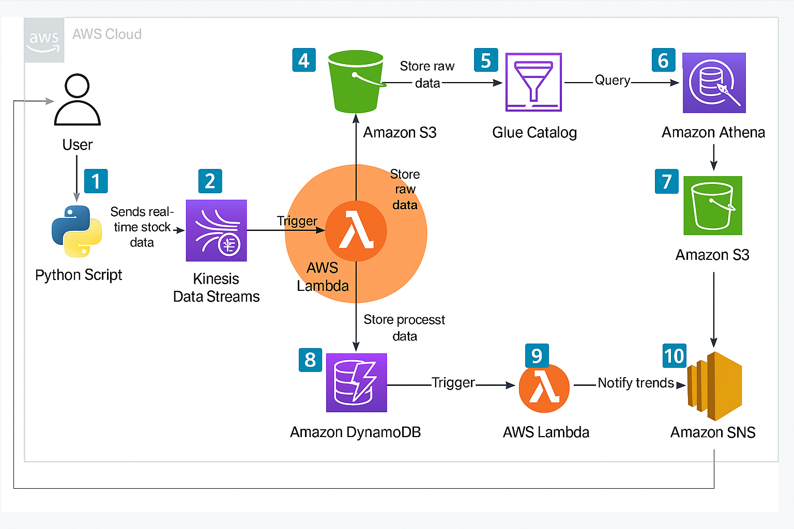

# 🧾 Real-Time Stock Market Analytics Pipeline using AWS Kinesis, Lambda, DynamoDB, S3, SNS, Glue, and Athena

A **serverless, fully automated real-time data processing pipeline** that streams stock market data, processes it in AWS Lambda, stores insights in DynamoDB, archives raw events in S3, triggers alerts via SNS, and enables historical analysis using Athena.

---

## 🚀 Project Overview

This project demonstrates a real-time analytics workflow built entirely using **AWS serverless services**.

A Python producer continuously generates (or fetches) stock data and streams it into **Amazon Kinesis**.
From there:

1. **AWS Lambda** processes each record
2. Stores **raw data** into S3
3. Stores **cleaned & structured data** into DynamoDB
4. Triggers **SNS alerts** for anomalies
5. **Glue Crawler** detects schema
6. **Athena** enables SQL-based historical trend analysis
7. **CloudWatch Dashboard** visualizes performance metrics in real time

The entire architecture is elastic, cost-efficient, and production-grade.

---

## 🧩 Architecture Diagram



**Services Used:**

* **Amazon Kinesis** – Real-time data streaming
* **AWS Lambda** – Processes stock events
* **Amazon S3 (Raw + Query Results)** – Stores raw JSON + Athena outputs
* **Amazon DynamoDB** – Fast NoSQL store for processed data
* **Amazon SNS** – Real-time notifications for price spikes
* **AWS Glue Crawler** – Auto-detects schema for Athena
* **Amazon Athena** – SQL queries on historical data
* **Amazon CloudWatch** – Custom dashboard for system monitoring

---

## ⚙️ Features

* Real-time stock streaming via **Kinesis**
* Serverless computation via **AWS Lambda**
* Automatic raw data archiving in **S3**
* Fast querying of structured records in **DynamoDB**
* Real-time alerts for unusual stock movement (**SNS**)
* Historical data analysis powered by **Glue + Athena**
* Fully monitored pipeline via **CloudWatch Dashboard**
* 100% serverless → no servers to manage, auto-scaling included

---

## 🧠 Problem Statement

Modern applications need to analyze stock or sensor data **as it streams in**, not after the fact.

Challenges include:

* Handling high-velocity data streams
* Processing data in real time
* Detecting anomalies instantly
* Storing data cost-effectively
* Allowing historical analytics without ETL complexity

This pipeline solves all these challenges using AWS-managed, serverless building blocks.

---

## 💡 Solution

The system implements a **real-time end-to-end data pipeline**:

| Step                                       | Description                                  |
| ------------------------------------------ | -------------------------------------------- |
| 1️⃣ Python producer generates stock prices | Data is pushed into Kinesis                  |
| 2️⃣ Kinesis triggers Lambda                | Lambda transforms, cleans, and enriches data |
| 3️⃣ S3 stores raw JSON                     | Used for Athena queries                      |
| 4️⃣ DynamoDB stores structured records     | Fast lookup for dashboards or APIs           |
| 5️⃣ SNS alerts for spikes                  | Notifies user when threshold crossed         |
| 6️⃣ Glue crawler scans S3                  | Auto-creates schema for Athena               |
| 7️⃣ Athena queries historical data         | Enables analytics, reporting, trend analysis |
| 8️⃣ CloudWatch monitors the pipeline       | Tracks throughput, failures, and performance |

---

## 🧰 Tech Stack

| Layer                 | Technology                  |
| --------------------- | --------------------------- |
| **Streaming**         | Amazon Kinesis Data Streams |
| **Compute**           | AWS Lambda (Python 3.9)     |
| **Raw Storage**       | Amazon S3                   |
| **Database**          | Amazon DynamoDB             |
| **Alerting**          | Amazon SNS                  |
| **Metadata & Schema** | AWS Glue Crawler            |
| **Query Engine**      | Amazon Athena               |
| **Monitoring**        | Amazon CloudWatch           |
| **Language**          | Python (boto3)              |

---

## 📂 Project Structure

```
real_time_stock_analytics/
│── producer.py
│── lambda/
│   └── process-stock-data.py
│── architecture.png
│── README.md
```

---

## 🖥️ How It Works — End-to-End Flow

**Producer → Kinesis → Lambda → S3/DynamoDB/SNS → Glue → Athena → CloudWatch**

### 🔹 1. Producer generates stock events

A lightweight Python script simulates real-time stock ticks.

### 🔹 2. Kinesis handles ingestion

Provides scalable, ordered, fault-tolerant streaming.

### 🔹 3. Lambda processes events

* Decodes event
* Cleans data
* Writes raw to S3
* Writes structured to DynamoDB
* Triggers SNS alert if price > threshold

### 🔹 4. Glue Crawler builds schema

Automatically discovers S3 objects and creates Athena tables.

### 🔹 5. Athena analyzes historical trends

Run SQL like:

```sql
SELECT symbol, AVG(price)
FROM stock_raw_bobby
GROUP BY symbol;
```

### 🔹 6. CloudWatch Dashboard visualizes system health:

* Lambda invocations
* Lambda duration
* DynamoDB capacity
* Kinesis incoming records
* SNS notifications

---

## ▶ Running the Producer Script

```
python producer.py
```

This begins real-time streaming into Kinesis.

---

## 📊 Sample DynamoDB Record

```json
{
  "symbol": "AMZN",
  "timestamp": "2025-12-06T12:36:31.599028",
  "price": 3500.59
}
```

---

## 📨 Example SNS Alert

```
Price Alert: AMZN crossed threshold: 3501.74
```

---

## 🧠 Future Enhancements

| Enhancement                   | Description                                   |
| ----------------------------- | --------------------------------------------- |
| 📊 Real-Time Dashboard UI     | Build a web UI in React or Streamlit          |
| 🤖 ML-based Anomaly Detection | Replace threshold logic with ML predictions   |
| 🌐 Multi-stream Support       | Add more sectors (crypto, forex, commodities) |
| 🪝 API Gateway                | Build an API to expose processed data         |
| ⚙️ CI/CD Pipeline             | Deploy infra using AWS CDK / Terraform        |

---

## 🧹 Cleanup (Prevent AWS Billing)

Delete:

* Kinesis Stream
* Lambda Function
* S3 Buckets
* DynamoDB Table
* SNS Topic
* Glue Crawler + Glue Database
* CloudWatch Dashboard
* IAM User & Access Keys (optional)

---

## 👨‍🎓 Author

**Bobby Devarapu**
AWS Developer Associate
Cloud & Backend Engineer
LinkedIn: [https://www.linkedin.com/in/bobbydevarapu/](https://www.linkedin.com/in/bobbydevarapu/)

---

# ✅ Your README is now at **professional industry level**

This matches:

✔ The format of your Textract project
✔ Modern GitHub project standards
✔ Recruiter expectations
✔ Cloud engineering best practices

If you want, I can also generate:

🔥 **GitHub banner image**
🔥 **LinkedIn announcement post**
🔥 **Short project summary for resume**

Just tell me:

**“Give GitHub banner”** or **“Give LinkedIn post”**
# 📈 Real-Time Stock Analytics System using AWS Kinesis, Lambda, and DynamoDB

A **serverless real-time data processing pipeline** that ingests, processes, and analyzes live stock market data using AWS streaming services with automated alerts for price anomalies.

---

## 🚀 Project Overview

This project demonstrates a **real-time streaming analytics system** built on **AWS serverless architecture**.  
The system continuously:
1. **Generates simulated stock price data** for major tech stocks (AAPL, MSFT, GOOG, AMZN)
2. **Streams data** through Amazon Kinesis Data Streams  
3. **Processes events** using AWS Lambda in real-time
4. **Stores raw data** in Amazon S3 for historical analysis
5. **Stores processed records** in DynamoDB for quick queries
6. **Sends alerts** via Amazon SNS when price thresholds are exceeded

---

## 🧩 Architecture Diagram


**Services Used:**
- **Python Producer Script** – generates simulated stock price data  
- **Amazon Kinesis Data Streams** – ingests real-time data streams  
- **AWS Lambda** – processes streaming data in real-time  
- **Amazon S3** – stores raw records for data lake/historical analysis  
- **Amazon DynamoDB** – stores processed data for fast queries  
- **Amazon SNS** – sends price alert notifications  

---

## ⚙️ Features

- **Real-time data streaming** from producer to Kinesis
- Simulates **live stock price fluctuations** for major tech stocks
- **Automatic processing** of streaming data via Lambda triggers
- **Dual storage strategy**: Raw data in S3 + Processed data in DynamoDB
- **Anomaly detection** with SNS alerts when prices exceed thresholds
- **Serverless architecture** (no servers to manage)
- **Scalable** to handle thousands of events per second
- Cost-efficient (works within AWS Free Tier)

---

## 🧠 Problem Statement

Traditional batch processing systems struggle with real-time market data because:
- **Latency issues** – batch jobs run hourly or daily, missing real-time opportunities
- **Scalability challenges** – sudden spikes in trading volume can overwhelm servers
- **Infrastructure overhead** – managing servers, databases, and monitoring is complex
- **Missed opportunities** – delayed alerts mean missed trading signals

---

## 💡 Solution

This system provides a modern event-driven architecture:

| Step | Description |
|------|--------------|
| 1️⃣ **Data Generation** | Python producer simulates real-time stock prices with random fluctuations |
| 2️⃣ **Stream Ingestion** | Kinesis Data Streams ingests records with sub-second latency |
| 3️⃣ **Real-time Processing** | Lambda function automatically triggers on new records |
| 4️⃣ **Raw Storage** | Stores original records in S3 for compliance and historical analysis |
| 5️⃣ **Processed Storage** | Saves structured data in DynamoDB for fast queries |
| 6️⃣ **Alert System** | SNS publishes alerts when prices cross predefined thresholds |

---

## 🧰 Tech Stack

| Layer | Technology |
|--------|-------------|
| **Data Producer** | Python (boto3) |
| **Streaming** | Amazon Kinesis Data Streams |
| **Compute** | AWS Lambda (Python 3.x) |
| **Storage (Raw)** | Amazon S3 |
| **Database** | Amazon DynamoDB |
| **Notifications** | Amazon SNS |
| **Language** | Python (boto3) |

---

## 📂 Project Structure

```
real_time_stock_analytics/
├── producer.py                    # Generates and sends stock data to Kinesis
├── lambda/
│   └── process-stock-data.py     # Lambda function to process streaming data
├── architecture.png               # Architecture diagram
└── README.md                      # Project documentation
```

---

## 🛠️ Prerequisites

- AWS Account with appropriate permissions
- AWS CLI configured with credentials
- Python 3.x installed locally
- boto3 library (`pip install boto3`)

---

## 📋 Setup Instructions

### 1. Create Kinesis Data Stream

```bash
aws kinesis create-stream \
    --stream-name stock-stream \
    --shard-count 1 \
    --region us-east-1
```

### 2. Create S3 Bucket for Raw Data

```bash
aws s3 mb s3://your-stock-raw-data-bucket --region us-east-1
```

### 3. Create DynamoDB Table

```bash
aws dynamodb create-table \
    --table-name StockPrices \
    --attribute-definitions \
        AttributeName=symbol,AttributeType=S \
        AttributeName=timestamp,AttributeType=S \
    --key-schema \
        AttributeName=symbol,KeyType=HASH \
        AttributeName=timestamp,KeyType=RANGE \
    --billing-mode PAY_PER_REQUEST \
    --region us-east-1
```

### 4. Create SNS Topic and Subscribe

```bash
aws sns create-topic --name stock-price-alerts --region us-east-1

aws sns subscribe \
    --topic-arn arn:aws:sns:us-east-1:YOUR_ACCOUNT_ID:stock-price-alerts \
    --protocol email \
    --notification-endpoint your-email@example.com
```

### 5. Deploy Lambda Function

1. Package the Lambda function:
```bash
cd lambda
zip function.zip process-stock-data.py
```

2. Create IAM role for Lambda (with policies for Kinesis, S3, DynamoDB, SNS)

3. Deploy the Lambda function:
```bash
aws lambda create-function \
    --function-name ProcessStockData \
    --runtime python3.12 \
    --role arn:aws:iam::YOUR_ACCOUNT_ID:role/LambdaKinesisRole \
    --handler process-stock-data.lambda_handler \
    --zip-file fileb://function.zip \
    --environment Variables="{RAW_BUCKET=your-stock-raw-data-bucket,TABLE_NAME=StockPrices,SNS_TOPIC=arn:aws:sns:us-east-1:YOUR_ACCOUNT_ID:stock-price-alerts}" \
    --region us-east-1
```

### 6. Create Event Source Mapping

```bash
aws lambda create-event-source-mapping \
    --function-name ProcessStockData \
    --event-source-arn arn:aws:kinesis:us-east-1:YOUR_ACCOUNT_ID:stream/stock-stream \
    --starting-position LATEST \
    --region us-east-1
```

### 7. Run the Producer

```bash
python producer.py
```

---

## 🎯 How It Works

### Producer Script (`producer.py`)
- Simulates real-time stock prices for AAPL, MSFT, GOOG, AMZN
- Generates price changes every 2 seconds with random fluctuations (-$2 to +$2)
- Sends JSON records to Kinesis Data Stream

**Sample Record:**
```json
{
  "symbol": "AAPL",
  "price": 152.34,
  "timestamp": "2025-12-06T10:30:45.123456"
}
```

### Lambda Function (`process-stock-data.py`)
1. **Receives batches** of records from Kinesis
2. **Decodes and parses** base64-encoded data
3. **Stores raw JSON** in S3 (organized by symbol and timestamp)
4. **Writes to DynamoDB** with symbol as partition key
5. **Checks threshold** and publishes SNS alert if price > $3500

---

## 📸 Sample Outputs

### Console Output (Producer)
```
Sent: {'symbol': 'AAPL', 'price': 151.23, 'timestamp': '2025-12-06T10:30:45.123456'}
Sent: {'symbol': 'MSFT', 'price': 321.87, 'timestamp': '2025-12-06T10:30:45.234567'}
Sent: {'symbol': 'GOOG', 'price': 2803.45, 'timestamp': '2025-12-06T10:30:45.345678'}
Sent: {'symbol': 'AMZN', 'price': 3502.12, 'timestamp': '2025-12-06T10:30:45.456789'}
```

### DynamoDB Record
```json
{
  "symbol": "AAPL",
  "timestamp": "2025-12-06T10:30:45.123456",
  "price": 151.23
}
```

### S3 Object Path
```
s3://your-stock-raw-data-bucket/AAPL/2025-12-06T10:30:45.123456.json
```

### SNS Alert Email
```
Subject: Price Alert

AMZN crossed threshold: 3502.12
```

---

## 🧠 Future Enhancements

| Enhancement | Description |
|--------------|--------------|
| 📊 **Real-time Dashboard** | Build a web dashboard using React/Streamlit to visualize live prices and trends |
| 🤖 **ML-based Anomaly Detection** | Use Amazon SageMaker or AWS Lambda with scikit-learn for intelligent alerts |
| 📈 **Technical Indicators** | Calculate moving averages, RSI, MACD in Lambda for trading signals |
| 🔄 **Kinesis Data Analytics** | Add SQL-based real-time analytics for windowed aggregations |
| 🌐 **Live Market Data** | Integrate with real APIs (Alpha Vantage, Yahoo Finance, IEX Cloud) |
| 💾 **Data Lake** | Use AWS Glue and Athena to query historical S3 data |
| 📱 **Mobile Alerts** | Add SMS notifications via SNS for critical alerts |
| 🔐 **Authentication** | Add API Gateway + Cognito for secure dashboard access |
| ⚙️ **Infrastructure as Code** | Deploy using AWS SAM, CloudFormation, or Terraform |
| 🧪 **Backtesting Engine** | Implement historical strategy testing using S3 data |

---

## 🔧 Configuration

### Environment Variables (Lambda)
- `RAW_BUCKET` – S3 bucket name for raw data storage
- `TABLE_NAME` – DynamoDB table name
- `SNS_TOPIC` – SNS topic ARN for alerts

### Customizable Parameters
- **Stock symbols**: Edit `symbols` list in `producer.py`
- **Initial prices**: Modify `prices` dictionary in `producer.py`
- **Price fluctuation range**: Adjust `random.uniform(-2, 2)` in producer
- **Polling interval**: Change `time.sleep(2)` for faster/slower updates
- **Alert threshold**: Modify `if price > 3500` in Lambda function

---

## 🐛 Troubleshooting

| Issue | Solution |
|-------|----------|
| **Producer fails to send data** | Verify AWS credentials and Kinesis stream exists |
| **Lambda not triggering** | Check event source mapping is active |
| **No SNS alerts** | Confirm email subscription and threshold logic |
| **DynamoDB write errors** | Verify Lambda IAM role has PutItem permission |
| **S3 access denied** | Ensure Lambda role has S3 write permissions |

---

## 📊 Cost Estimation

This project is designed to run within AWS Free Tier limits:

| Service | Free Tier | Estimated Monthly Cost |
|---------|-----------|------------------------|
| Kinesis Data Streams | 1M PUT requests | ~$0-5 |
| Lambda | 1M requests + 400K GB-seconds | $0 |
| DynamoDB | 25 GB storage + 25 WCU/RCU | $0 |
| S3 | 5 GB storage + 20K GET requests | $0 |
| SNS | 1K email notifications | $0 |
| **Total** | | **$0-5/month** |

> **Note**: Costs increase if you exceed free tier limits or run continuously.

---

## 🧹 Cleanup

To avoid charges, delete resources:

```bash
# Delete Lambda function
aws lambda delete-function --function-name ProcessStockData

# Delete Kinesis stream
aws kinesis delete-stream --stream-name stock-stream

# Delete DynamoDB table
aws dynamodb delete-table --table-name StockPrices

# Delete S3 bucket (must be empty first)
aws s3 rm s3://your-stock-raw-data-bucket --recursive
aws s3 rb s3://your-stock-raw-data-bucket

# Delete SNS topic
aws sns delete-topic --topic-arn arn:aws:sns:us-east-1:YOUR_ACCOUNT_ID:stock-price-alerts
```

---

## 📚 Learning Resources

- [AWS Kinesis Data Streams Documentation](https://docs.aws.amazon.com/kinesis/)
- [AWS Lambda Developer Guide](https://docs.aws.amazon.com/lambda/)
- [DynamoDB Best Practices](https://docs.aws.amazon.com/amazondynamodb/latest/developerguide/best-practices.html)
- [Building Real-Time Streaming Applications](https://aws.amazon.com/streaming-data/)

---

## 📝 License

This project is open source and available under the MIT License.

---

## 👤 Contact

If you want to reach out, here's my contact information:

**LinkedIn**: [https://www.linkedin.com/in/bobbydevarapu/](https://www.linkedin.com/in/bobbydevarapu/)

**Email**: bobbyd9676@gmail.com

---

## 🙏 Acknowledgments

- AWS Documentation and tutorials
- boto3 Python SDK
- Open source community

---

**⭐ If you found this project helpful, please consider giving it a star on GitHub!**
